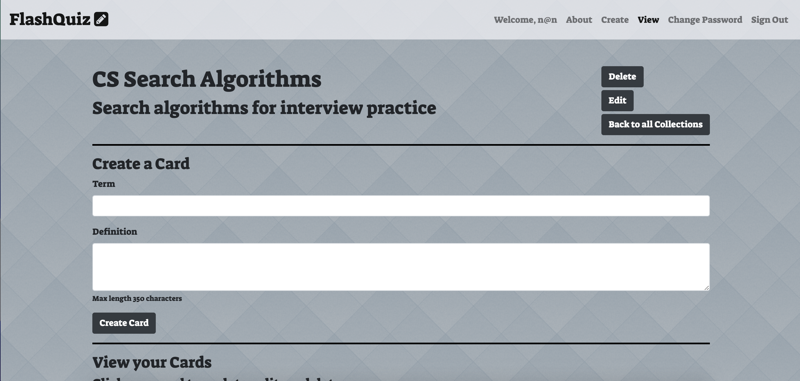
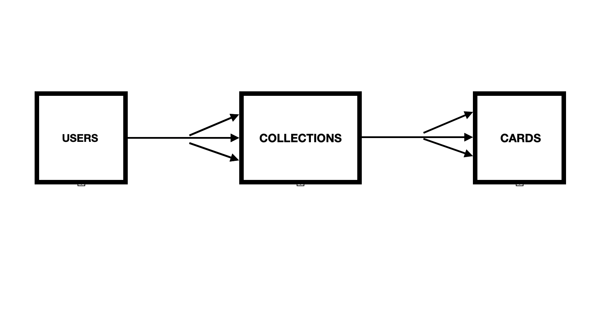

## Overview

FlashQuiz is a full-stack flashcard application where you can learn new words, or study for tests, or prepare for interviews, or any other studying you could think of. Users create collections of different studying topics, which hold as many cards as they need.

It uses MongoDB and Express for the backend, and React, JavaScript, Bootstrap, and Axios for the frontend.

### Installation Details

In order to manipulate and program this application for yourself, feel free to fork and clone this repo. Afterwards, ensure that you copy and paste the .gitignore file if you lose it in the process, and `npm install` afterwards.

If you want to run your server, use `npm start`.

### Acknowledgements

A HUGE thank you to [Esat Ozen](https://github.com/ozenesat), who helped me solve the many frontend and backend bugs I had. I would not have been able to finish this project without your help!

### Development Process

This was my first application that required CRUDing on more than one resource, and it was a very rewarding experience. It presented quite a few challenges, especially in the backend, as I was establishing relationships in a non-relational database (MongoDB and Express). I'm still relatively uncomfortable with MongoDB and Express, and working with backend frameworks in general is still difficult for me, but I'm just glad that it works as expected for FlashQuiz. It also solidified for me that there is still so much for me to learn.

Working with React again was lots of fun, and gave me the opportunity to improve my skills. I really enjoy working with React, and this project allowed me to spend more time creating, debugging, and learning more about the library. Working on two resources meant creating more components, manipulating more information, and passing more props. I spent many late nights fixing small bugs that had the simplest solutions - but often those problems help you learn the most.

One particularly complex yet fun component to work on was my CollectionShow component, which held five Axios calls and had tons of content packed into it, including the fun flip-card functionality. It wasn't very logic-heavy code, but it was by far the most dense component I'd ever created.

Overall, it was a very rewarding experience. I hope to work more with React in my working career.

### Tests

There are a few tests that have been created for this application that you can run should you decide you want to. They are located in the root file `tests`. In order to run them, simply type `node tests/<test-file>/js`. These are simple, rudimentary automated tests that check if you can login, sign up, or create a collection.

There are also tests being created with Cypress that are currently-in-progress (the first of which can be see in the `cypress/integration/login.js` file). These include assertions so if they fail at any point you can follow along and see what went wrong. Installation details for Cypress can be found [here](https://docs.cypress.io/guides/getting-started/installing-cypress.html#System-requirements).

### Fixes for Future Iterations

There are a few things I'd like to work on for a v.2:

-   Making it more more mobile-friendly (the flashcards don't show up correctly in mobile)
-   Work on adding gradients or more colorful pieces of CSS
-   Perfecting and tweaking the flip card functionality and appearance
-   Adding a 'favorite' functionality to collections or cards

### Technologies Used

React, JavaScript, Bootstrap, MongoDB, and Express.

### ERD

### Links

Name | Link
-----|-----
FlashQuiz Frontend Repo  |  https://github.com/mtsai920/flashquiz-client
FlashQuiz Backend Repo  |  https://github.com/mtsai920/flashquiz-api
Frontend Deployed Site  |  https://mtsai920.github.io/flashquiz-client/#/
Backend Deployed Site  |  https://ancient-spire-36113.herokuapp.com/
